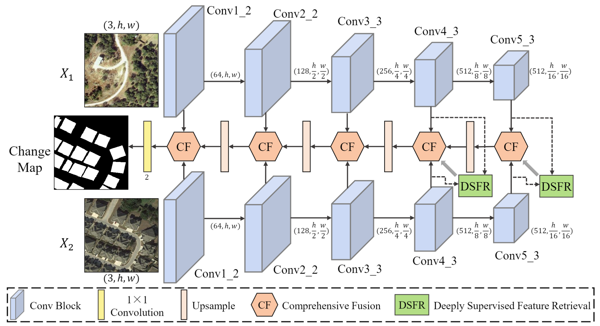
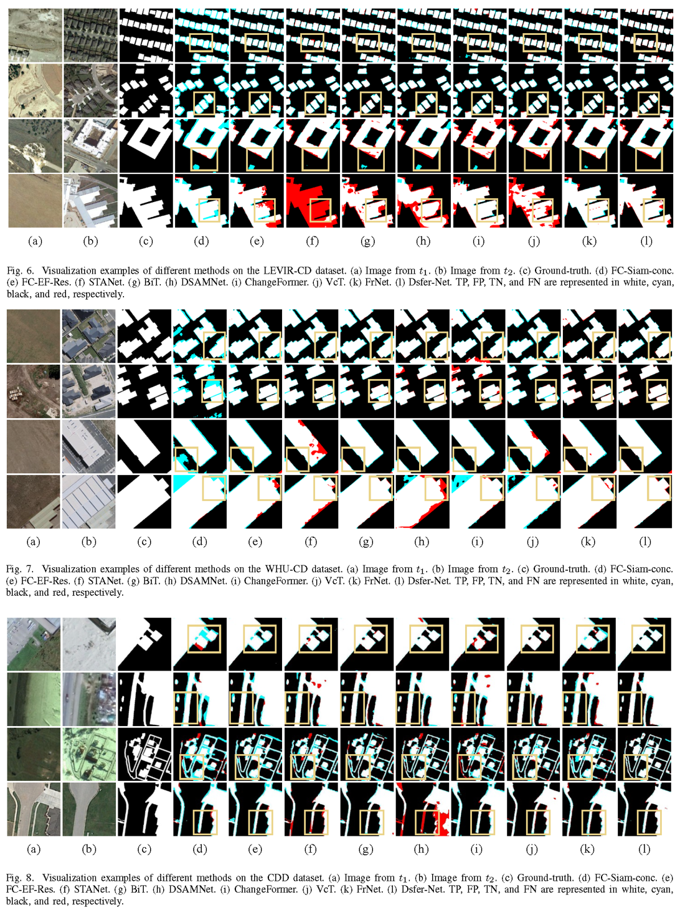
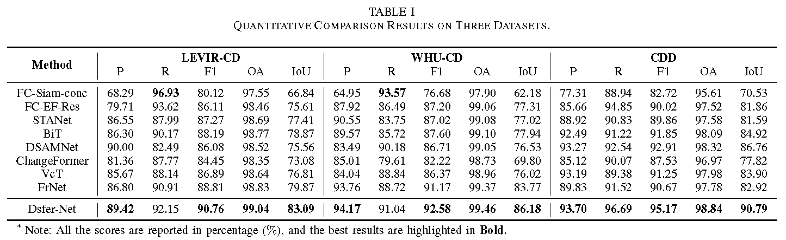

# Dsfer-Net: A Deep Supervision and Feature Retrieval Network for Bitemporal Change Detection Using Modern Hopfield Network

[Shizhen Chang](https://scholar.google.com/citations?user=tC5_nA8AAAAJ&hl=zh-CN&oi=ao), <a href="https://github.com/mkk20">Michael Kopp</a> and <a href="http://pedram-ghamisi.com/">Pedram Ghamisi</a>



## Introduction
This project concludes the official Pytorch implementation for applying Hopfield layer for deep feature retrieval and aggregration in our paper **Dsfer-Net: A Deep Supervision and Feature Retrieval Network for Bitemporal Change Detection Using Modern Hopfield Network** which has been conducted at the [Institute of Advanced Research in Artificial Intelligence (IARAI)](https://www.iarai.ac.at/).

## Clues of the project:
 1. [Preliminaries](#preliminaries)
 2. [Usage](#usage)
 3. [Results](#results)
 4. [Paper](#paper)
 5. [Acknowledgement](#acknowledgement)
 6. [License](#license)
 
### Preliminaries
- Environments:
```bash
s1.11.0+cu113
numpy==1.23.0
einops==0.4.1
scikit-image==0.18.0
scikit-learn==0.24.1
```
- Datasets and Settings:

Three datasets are used in this repo: LEVIR-CD dataset, WHU-CD dataset, and CDD dataset. 

Detailed settings of the datasets can be found in our paper, and the cropped image can also be downloaded from: 

** LEVIR-CD: https://drive.google.com/file/d/1gjWOZLsRKLVsK80YJf_2BEPLX9PTI_W9/view?usp=drive_link

** WHU-CD: https://drive.google.com/file/d/1HodqUkd5yidd0vo_tMBtTyFHqmDD38zg/view?usp=drive_link

** CDD-CD: https://drive.google.com/file/d/1Q4Os8YPT2AUpqE4MhdPKxm6NAgCnOkBN/view?usp=drive_link

The path of the images is orgarnied as follow: 
```bash
├─ <Root-path-of-the LEVIR-CD and CDD dataset>/
│   ├──train/
│   │  ├──A
│   │  ├──B
│   │  ├──label
│   ├──val/
│   │  ├──A
│   │  ├──B
│   │  ├──label
│   ├──test/
│   │  ├──A
│   │  ├──B
│   │  ├──label
```
```bash
├─ <Root-path-of-the WHU dataset>/
│───A
│───B
│───label
```
###  Usage
- Main arguments of this repo:
```
--dataID                    dataset id in the training/testing.
--data_dir                  root directory of the datasets.
--batch_size                number of images in each batch.
--lam                       the pernatly scalar on loss.
--learning_rate             learning rate.
--weight_decay              regularisation parameter for L2-loss.
--num_steps                 number of training steps.
--num_steps_stop            number of training steps for early stopping.
```
- Pretrain the network on training and validation sets:

```
python Train.py
```

Alternatively, you can download our [pretrained models](https://drive.google.com/file/d/16SmembbauK8AmEIrdA3XAiNvi5uAzWp1/view?usp=sharing) for a quick look.

- Evaluating the performance on the test set:

```blash
python Test.py
```

### Results
- Examples of the visualized results of different methods on three datasets:



- Quantitative analysis of different networks:



### Paper

For researchers who are interested in using this project, please cite the following paper:

```
@article{chang2022Dsfernet,
  title={Dsfer-Net: A Deep Supervision and Feature Retrieval Network for Bitemporal Change Detection Using Modern Hopfield Network},
  author={Chang, Shizhen and Kopp, Michael and Ghamisi, Pedram},
  year={2022}
}
```

### Acknowledgement

The authors would like to thank the authors of all comparative methods for sharing their codes, the contributors of the [LEVIR-CD](https://justchenhao.github.io/LEVIR/), [WHU-CD](http://gpcv.whu.edu.cn/data/building_dataset.html), and [CDD](https://drive.google.com/file/d/1GX656JqqOyBi_Ef0w65kDGVto-nHrNs9/edit) datasets, Dr. Yonghao Xu for his valuable comments and discussions, and the Institute of Advanced Research in Artificial Intelligence (IARAI) for its support.


### License

This repo is distributed under [MIT License](https://github.com/ShizhenChang/Dsfer-Net/blob/main/LICENSE.txt). The code can be used for academic purposes only.
