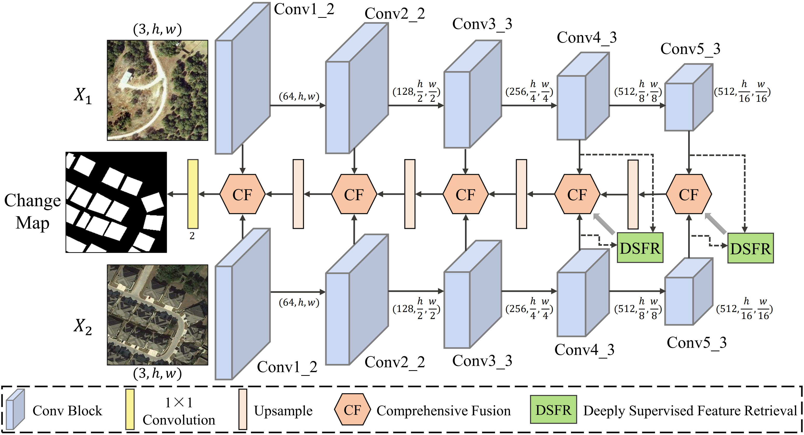

<h1 align="center">Dsfer-Net: A Deep Supervision and Feature Retrieval Network for Bitemporal Change Detection Using Modern Hopfield Networks</h1>

<h3 align="center"> Shizhen Chang, <a href="https://github.com/mkk20/">Michael Kopp</a>, and <a href="https://www.ai4rs.com/">Pedram Ghamisi</a></h3>
<br

*This research has been conducted at the [Institute of Advanced Research in Artificial Intelligence (IARAI)](https://www.iarai.ac.at/).*
    
This is the official PyTorch implementation of the paper **[Dsfer-Net: A Deep Supervision and Feature Retrieval Network for Bitemporal Change Detection Using Modern Hopfield Networks](https://arxiv.org/abs/2304.01101)**.
    

### Implementation
Coming soon!
